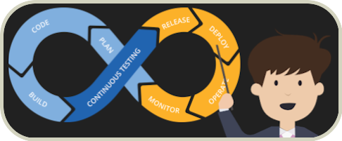
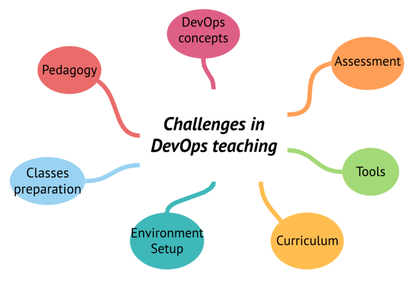

<p align="center"> 
   
</p>

<p align="center">

<a href="https://github.com/devops-education/Challenges-in-Devops-Education/blob/master/LICENSE" target="blank">

</a>
<a href="https://github.com/devops-education/Challenges-in-Devops-Education/stargazers" target="blank">

</a>
<a href="https://github.com/devops-education/Challenges-in-Devops-Education/issues" target="blank">

</a>
<a href="https://github.com/devops-education/Challenges-in-Devops-Education/pulls" target="blank">

</a>
</p>


It's a repository that contains a set of challenges in DevOps teaching. The objective is to help DevOps educators to teach DevOps. Some of theses challenges are found in the paper [Challenges and Recommendations in DevOps Education: A Systematic Literature Review](https://dl.acm.org/doi/abs/10.1145/3422392.3422496) published at the academic conference **SBES '20: Proceedings of the 34th Brazilian Symposium on Software Engineering**. 

### Table of Content

- [Challenges teaching DevOps](#challenges-teaching-devops) 
- [Contributors and contribute](#contributors-and-contribute)

## Challenges teaching DevOps

To facilitate understanding, the challenges were organized in themes. Then, theses are the following themes:

<p align="center"> 
   
</p>


### [Curriculum](https://github.com/devops-education/Challenges-in-Devops-Education/issues?q=is%3Aissue+is%3Aopen+label%3Acurriculum+label%3Achallenge-existed+)

```
The Curriculum theme is related to the content, hourly load and the number of 
subjects needed to use DevOps. The relationship between the DevOps discipline 
and the prerequisite disciplines of this subject is also considered, as well 
as the interaction with the others of a software engineering course.
```

- [DevOps still received minor attention in higher education.](https://github.com/devops-education/Challenges-in-Devops-Education/issues/3)
- [The time available to teach CD and CI is devoted to other concepts.](https://github.com/devops-education/Challenges-in-Devops-Education/issues/4)
- [Devops mindset should be considered to fine tune curricula.](https://github.com/devops-education/Challenges-in-Devops-Education/issues/5)
- [Teaching DevOps is multidisciplinary and therefore crosscutting the traditional course boundaries.](https://github.com/devops-education/Challenges-in-Devops-Education/issues/6)
- [The little time available to teaching complexities of CD and CI.](https://github.com/devops-education/Challenges-in-Devops-Education/issues/7)
- [Courses teach “Dev” rather than “Ops”.](https://github.com/devops-education/Challenges-in-Devops-Education/issues/8)

### [Tools](https://github.com/devops-education/Challenges-in-Devops-Education/issues?q=is%3Aissue+is%3Aopen+label%3Atools+label%3Achallenge-existed+)
```
The Tool theme includes software used to operationalize DevOps practices. 
They can be those widely used in the industry or those created with a teaching 
standard.
```

- [DevOps tools are new and time-consuming for a universitary lecturer.](https://github.com/devops-education/Challenges-in-Devops-Education/issues/9)
- [Some DevOps tools involve learning curve.](https://github.com/devops-education/Challenges-in-Devops-Education/issues/10)
- [DevOps tools are complex.](https://github.com/devops-education/Challenges-in-Devops-Education/issues/11)
- [Many DevOps tools for teacher to learn.](https://github.com/devops-education/Challenges-in-Devops-Education/issues/12)
- [DevOps overhead of keeping up with the industrial state-of-the-art at universities is often too high.](https://github.com/devops-education/Challenges-in-Devops-Education/issues/13)

### [Assessment](https://github.com/devops-education/Challenges-in-Devops-Education/issues?q=is%3Aissue+is%3Aopen+label%3Aassessment+label%3Achallenge-existed+)
```
The Assessment theme includes necessary and permanent didactic tasks in 
the teacher's work with the objective of diagnosing the learning situation 
of each student, in relation to the curriculum.
```
- [Teaching DevOps mindset is difficult to assess.](https://github.com/devops-education/Challenges-in-Devops-Education/issues/14)
- [DevOps increases evaluation workload for teachers.](https://github.com/devops-education/Challenges-in-Devops-Education/issues/15)

### [Classes preparation](https://github.com/devops-education/Challenges-in-Devops-Education/issues?q=is%3Aissue+is%3Aopen+label%3Aclasses-preparation+label%3Achallenge-existed+)
```
The topic Classes preparation refers to the planning of the course, including, 
for example, a research of reference material and preparation of classes.
```
- [There is little research into effective teaching pratices for incorporating DevOps into traditional software engineer courses.](https://github.com/devops-education/Challenges-in-Devops-Education/issues/16)
- [Lack of a proper and sound theory of DevOps.](https://github.com/devops-education/Challenges-in-Devops-Education/issues/17)
- [DevOps has not yet standardized with the Software Engineering Body of Knowledge.](https://github.com/devops-education/Challenges-in-Devops-Education/issues/18)
- [Limited research in teaching DevOps.](https://github.com/devops-education/Challenges-in-Devops-Education/issues/19)


### [Devops concepts](https://github.com/devops-education/Challenges-in-Devops-Education/issues?q=is%3Aissue+is%3Aopen+label%3Adevops-concepts+label%3Achallenge-existed+)
```
The DevOps Concepts are related to its main foundations, techniques 
and mentality (culture).
```

- [Students have difficulties in explaining IaC.](https://github.com/devops-education/Challenges-in-Devops-Education/issues/20)
- [Teachers need to learn dev and opt activities.](https://github.com/devops-education/Challenges-in-Devops-Education/issues/21)
- [The main challenge was to find ways of emphasizing the Ops part of the approach.](https://github.com/devops-education/Challenges-in-Devops-Education/issues/22)
- [Teach DevOps mindset/cultural.](https://github.com/devops-education/Challenges-in-Devops-Education/issues/23)
- [Teachers need to learn operations.](https://github.com/devops-education/Challenges-in-Devops-Education/issues/24)
- [Continuous Delivery and related concepts are complex.](https://github.com/devops-education/Challenges-in-Devops-Education/issues/25)

### [Environment setup](https://github.com/devops-education/Challenges-in-Devops-Education/issues?q=is%3Aissue+is%3Aopen+label%3Aenvironment-setup+label%3Achallenge-existed+)
```
The Environment setup theme refers to the preparatory activities 
of the environments used in the practices of students' exercises and projects.
```
- [DevOps requires complex and laborious architectures.](https://github.com/devops-education/Challenges-in-Devops-Education/issues/26)
- [Setup the tools and workflows increases the effort for educators.](https://github.com/devops-education/Challenges-in-Devops-Education/issues/27)

### [Pedagogy](https://github.com/devops-education/Challenges-in-Devops-Education/issues?q=is%3Aissue+is%3Aopen+label%3Apedagogy+label%3Achallenge-existed+)
```
References to the subject of Pedagogy are related to a set of
techniques, principles, methods and strategy for education and teaching.
```
- [How to set up the DevOps approach itself from scratch.](https://github.com/devops-education/Challenges-in-Devops-Education/issues/28)

## Contributors and contribute

Our thanks to everyone who helped this project.

You are more than welcome to contribute as well:

 - star this repository if you like it
 - share your challenge (or recommendation) via issue or [Slack](https://devops-education.slack.com/archives/C01RJV66G4V)
 
Please have a look at [CONTRIBUTING.md](https://github.com/devops-education/Challenges-in-Devops-Education/blob/main/CONTRIBUTING.md) for further suggestions and guidelines.

## License

This project is licensed under [Attribution-NonCommercial-NoDerivatives 4.0 International (CC BY-NC-ND 4.0)](http://creativecommons.org/licenses/by-nc-nd/4.0/).


